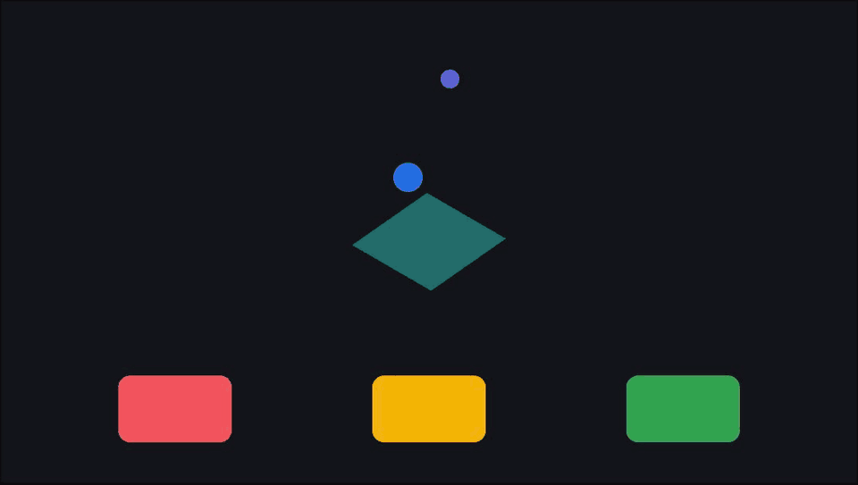

# Vecmo

A browser vector-motion editor that exports dependency-free runtime code.

- Export motion as code, not video: a self-contained JS runtime with typed `.d.ts`, not a rendered clip.
- Agent-native: a typed scene/motion document, `vmactl` for headless/live command work, and 26 MCP tools let an agent read and edit a project.
- GPU Look Graph effects (grain, halftone, riso, CRT, VHS, lens) export to a `.dctl` file for DaVinci Resolve Studio 18+.



## Quick start

```sh
bun install && bun run dev
```

`/` opens the editor. It runs entirely in the browser: local-first, and nothing in this build talks to a server.

Checks: `bun run check`. Build: `bun run build`. No test suite ships in this repo (see [CONTRIBUTING.md](./CONTRIBUTING.md)).

## Try it

1. `bun run dev`, then open `/?ref=hello-motion`.
2. Export → **Motion / Code** → **EMBED** ("Motion Artifact", self-contained embeddable artifact).
3. Unzip the download: `hello-motion.runtime.js`, its `.d.ts`, a manifest, and a demo HTML page.

Other reference scenes live at `/?ref=<slug>`; see [`src/features/reference-scenes/model/registry.ts`](src/features/reference-scenes/model/registry.ts) for the full list.

## Export sizes (measured, gzip -9)

| Scene | Profile | Size |
| --- | --- | --- |
| `hello-motion` | EMBED (Motion Artifact) | 48.2 KB |
| Effects-heavy reference scenes (grain, masks, motion grammar) | EMBED (Motion Artifact) | 115–152 KB |

Reproduce: `bun run dev` → open `/?ref=<slug>` → Export → EMBED → gzip the `<slug>.runtime.js` file inside the downloaded zip.

Other export targets: WebGL player, PDF, WebM, SVG, and DCTL (DaVinci Resolve look export).

## MCP

Add the repo's `.mcp.json` to Claude Code or Cursor; it launches `bun run mcp:agent` (`scripts/vma-agent-mcp.ts`) as a local stdio server exposing 26 tools over a typed scene/motion document, for example `observe_document`, `apply_scene_commands`, and `export_artboard`. For headless or scripted work, `bun run vmactl` talks the same command envelope directly, without an MCP client. Read [`docs/agent-command-catalog.md`](docs/agent-command-catalog.md) for the full command reference and [`docs/live-mcp-agent-runbook.md`](docs/live-mcp-agent-runbook.md) for live-editing over the local relay (`bun run agent:bridge`).

## Scope

This repository is the editor: it runs fully in the browser, and nothing here talks to a server. The vecmo.dev hosted service (accounts, cloud projects, billing) is a separate, private backend and is not included.

## Architecture

Start at [`docs/architecture.md`](docs/architecture.md) for the responsibility layers (`app -> pages -> widgets -> features -> entities -> shared`) and [`docs/codemap.md`](docs/codemap.md) for where each subsystem lives.

## Contributing

See [CONTRIBUTING.md](./CONTRIBUTING.md).

## License

The editor is AGPL-3.0-only. A developer layer (the agent/CLI toolkit, the runtime player control/manifest code, and `packages/editor-kernel`) is MIT; see `REUSE.toml` for the exact file list. Everything you export — the runtime JS, the WebGL player, their `.d.ts` files, and your scene/motion/backup documents — carries an added AGPL §7 permission (the Vecmo Runtime Output Exception), so you can embed exported artifacts in proprietary sites and owe nothing back for them. Details: [LICENSING.md](./LICENSING.md).
